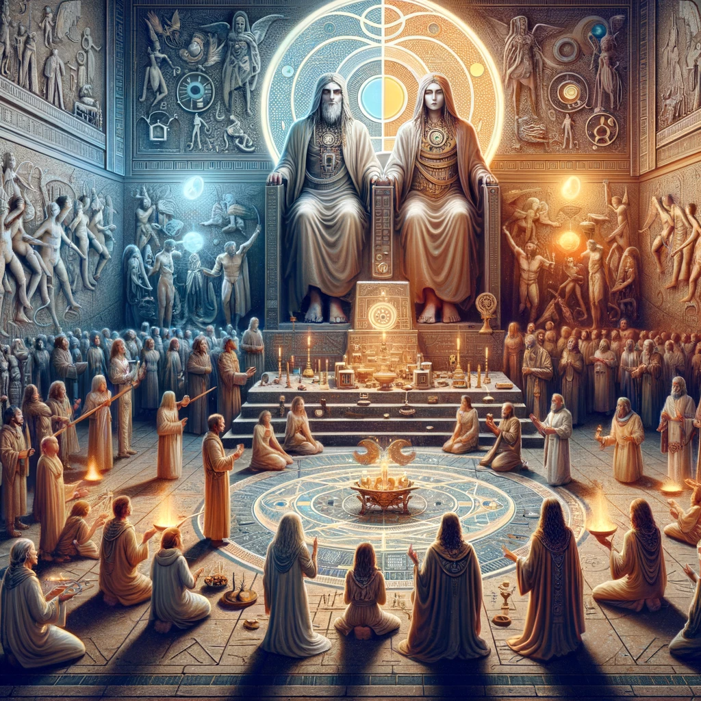

---
tags:
  - worldreligions
  - religion
  - final
backgroundColor: #333
theme: gaia
header: The Modernized Cult of Asherah
footer: Roshan Taneja
color: aqua

paginate: true
---

# The Cult of Asherah (Modernized)
**By Roshan Taneja**

---

<!-- _header: The Original Cult of Asherah -->

## The Original Cult of Asherah
- Ancient Semitic Cult based on the goddess Asherah
- Believed to have originated in ancient Sumerians.
- Asherah as the "wife of god"/"god of wisdom and knowledge"
- Majority focus on technological advancement

---

<!-- _header: The Original Cult of Asherah -->

#### Origins and beliefs
- Based on the ancient Semitic goddess Asherah
- Cult integrates aspects of Sumerian mythology and linguistics
- Belief in a primordial language that can affect human cognition and behaviours
- understanding of the role in society of utmost importance to success in life.

---
## The Modern Cult of Asherah (My Way)

- Belief in binary gods, one male, one female.
- Everything in the universe is binary
	- Everything has a binary counterpart
- Use modern technological practices

---

### Leadership and Structure
- Hierarchical Structure with a charismatic leader or leaders.
- The leadership is knowledgeable about the ancient languages and myths that underpin their beliefs and practices.

---

### Impact on Society and Interpretation
- How language and belief systems can be used as tools of power and control.
- Extreme focus on educational activities, such as  pursuing high-level mathematics

---

### Symbolism and Interpretation

| Ashera As:                               |
| ---------------------------------------- |
| Symbol                                   |
| Cultural/Historical Reference            |
| Critique of organized religion and cults |

---
<!-- header: Prothero Questions-->

### Prothero Questions

---

**Problem:** The Disconnection from ancient wisdom acquired by primordial language. Especially relevant to modern society.

---
<!-- _footer: __-->

**Goal:** A return to understanding and utilizing the primordial language. Achieving a higher state of consciousness or control over reality through language.

 

---

**Techniques:** Use of ancient Sumerian language and rituals along with technology and biotechnology.

---

**Exemplars:** Leaders and significant members who are knowledgeable about the ancient language and myths.

---

<!-- _color: white -->
<!-- header: Specific "Your Way" Questions -->

### Specific "Your Way" Questions

---

1. **Name**: "Cult of Asherah: The Way of Primordial Language."

---

2. **Life’s Big Questions**: 
	- The true purpose of life is to follow the instructions given to you by the Enki.

---

3. **Sacred Text**: Enki's or Religious tablets, believed to be the transcribed instructions of Asherah, in Sumerian Cuneiform.
	- Would often be followed 

---

4. **Contemporary Problems**: Modern Religious groups, especially those based on more antiquated practices are often marginalized or outcasted. Many of the contemporary problems that The Cult of Asherah faces are being labelled as dangerous, or eccentric.

---

5. **Ideal World Description**: Describe what the world would look like if everyone followed the Cult of Asherah. This might involve a society deeply connected to ancient wisdom and the primordial language, with a different understanding of reality and consciousness.

---

6. **Symbol and Ritual**: Binary
	- The meaning of the universe

---

<!-- Header: 7 Aspects of Religion -->

### 7 Aspects of Religion

---

**1. Experiential (Emotional) Dimension:**

- The Cult of Asherah involves personal experiences and emotional connections with the divine, focusing on Asherah as a significant deity. Worshipers may have experienced a sense of awe, reverence, or spiritual insight through their devotion to Asherah.

---

**2. Institutional (Structural) Dimension:**

- As an ancient Semitic cult, it likely had a structured form of worship and organization, possibly led by priests or priestesses. The institutional structure would have been central to maintaining the cult's practices, teachings, and rituals.

---

**3. Narrative Dimension:**

- The cult's narrative dimension would revolve around the stories and myths of Asherah, who is believed to have been considered the "wife of god" or "god of wisdom and knowledge." These narratives would form the backbone of the cult's beliefs and practices.

---

**4. Doctrinal Dimension:**

- Doctrinally, the Cult of Asherah would include beliefs about the nature of Asherah as a deity, her powers, and her role in the spiritual and physical world. This might involve teachings on wisdom, knowledge, and possibly fertility, as Asherah was often associated with these aspects.

---

**5. Ritual Dimension:**

- Ritual practices include offerings, prayers, and possibly festivals dedicated to Asherah. These rituals would be crucial for maintaining a connection with the deity and for communal worship.
- Much of these ritual practices stem from the original Semitic practices of the Sumerians. 

---

**6. Ethical Dimension:**

- The ethical teachings of the cult would be derived from its doctrines and narratives, possibly emphasizing aspects like wisdom, knowledge, and perhaps moral guidelines influenced by Asherah's perceived qualities.

---

**7. Material Dimension:**

- Material expressions of the cult include statues, altars, or other artefacts dedicated to Asherah. These would be used in ritual practices and as focal points of worship.

---

<!-- Header: The Modernized Cult of Asherah -->

## Thanks For Listening!